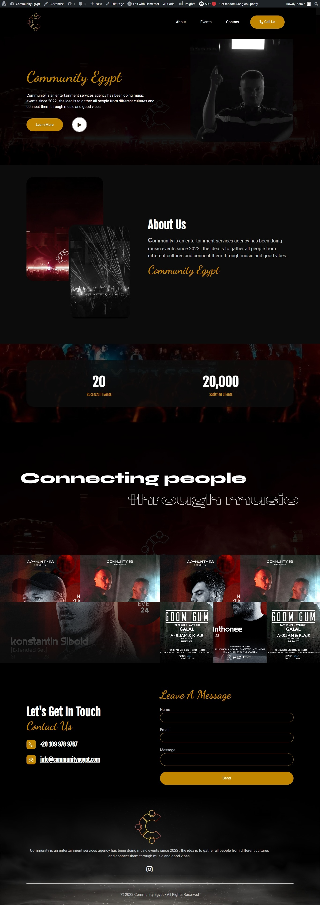

# Event Management with FooEvents for WooCommerce

## Overview

- This project is about events management with FooEvents for WooCommerce system that we developed to create and sell tickets for the events directly from our WooCommerce store to serve adequately scaled clients of an entertainment services firm that has been planning and managing events. The system is in charge of creating and generating tickets for users, as well as introducing custom variations for events using FooEvents, the ultimate event management solution seamlessly integrated with WooCommerce.
- We transformed our WooCommerce store into a powerhouse of affiliate marketing with YITH WooCommerce Affiliates Premium. This robust plugin introduced a seamless and efficient affiliate system that empowerd our business to grow through strategic partnerships.

## Key Features

- #### Event Ticketing Made Simple:

  created and sell tickets for the events directly from our WooCommerce store. FooEvents streamlines the ticketing process, allowing us to set up events effortlessly.

- #### Real-Time Ticket Sales:

  Watching ticket sales soar with real-time monitoring. Keeping track of ticket availability, sales, and attendee details directly from our WooCommerce dashboard.

- #### Customizable Ticket Designs:

  Showcased our brand with customizable ticket designs. Added our logo, event details, and branding elements to create professional and visually appealing tickets.

- #### Mobile Check-Ins:

  FooEvents enabled smooth mobile check-ins using the FooEvents Check-ins app, ensuring a seamless experience for event staff and attendees.

- #### Barcode and QR Code Integration:

  Enhanced security and streamlined entry with barcode and QR code integration. Tickets can be scanned easily using the FooEvents Check-ins app, reducing the risk of duplicate or fraudulent entries.

- #### Attendee Management:

  Keeping track of our event attendees effortlessly. Managing attendee information, check-in status, and ticket details directly from our WooCommerce dashboard.

- #### Automated Communication:

  Keeping attendees informed with automated email notifications. Send confirmation emails, event reminders, and updates to ensure a smooth experience for everyone involved.

- #### Effortless Affiliate Management:

  Managed our affiliates effortlessly with YITH WooCommerce Affiliates Premium. recruited, tracked, and rewarded our affiliate partners directly from our WooCommerce dashboard.

- #### Flexible Commission Structures:

  Tailored our commission structures to suit our business model. YITH WooCommerce Affiliates Premium offered flexibility in setting commission rates, allowing us to incentivize our affiliates based on our unique goals.

- #### Effortless Booking with WooCommerce:

  Browse through our events, and enjoy a seamless booking experience powered by WooCommerce, the leading e-commerce plugin for WordPress.

- #### Secure Transactions with We Accept for Paymob Payment Gateway:

  Book with confidence knowing that your transactions are secure. We've integrated the We Accept plugin to offer a reliable and trustworthy payment gateway for all your purchases.

- #### Enhanced Email Delivery with WP Mail SMTP:

  Stay informed with order confirmations and updates delivered straight to your inbox. WP Mail SMTP ensures reliable email delivery, keeping you in the loop at all times.

- #### Privacy and Control with WP Hide:
  Your privacy matters to us. WP Hide helps us maintain control over what information is visible, ensuring a secure and customized experience for every user.

## Demo Preview


   ### Landing Page



## Plugins Used

- WooCommerce
- WooCommerce Accept Payments
- FooEvents for WooCommerce
- FooEvents PDF Tickets
- Elementor Pro
- Flexible Checkout Fields
- WP Mail SMTP
- WP Hide
- We Accept for Paymob Payment Gateway
- WooCommerce Email Template Customizer Premium
- JetEngine
- Admin Menu Editor Pro
- Disable woocommerce logout confirmation
- Login/Signup Popup

## Configuration

### We Accept for Paymob Payment Gateway integration

```
After installing the WooCommerce Accept Payments plugin, new payment options like as Aman, Mobile Wallets, and valU will be available. All you have to do is configure the payment gateway and obtain the necessary information from your Paymob account:
api_key: ---
HMAC Secret: ---
Integration ID: ---
Iframe ID: ---
And then copy the Transaction processed callback from your configuration dashboard to your paymob account
Transaction processed callback: ---
Transaction response callback: ---

```

### YITH WooCommerce Affiliates Premium

```
Affiliate Dashboard:
Empowered our affiliates with a dedicated dashboard. Provide us with the tools we need to track our performance, view earnings, and access marketing materials to promote our events effectively.
Referral var name: ref
Referral cookie name: yith_wcaf_referral_token

```

### FooEvents for WooCommerce

```
    1. Install and Activate FooEvents
        Step 1: In the WordPress admin dashboard, navigate to "Plugins" > "Add New."
        Step 2: Click on the "Upload Plugin" button and upload the FooEvents ZIP file.
        Step 3: Activate the FooEvents plugin.

    2. Basic Settings
        Step 1: Once activated, go to "WooCommerce" > "FooEvents" in the WordPress dashboard.
        Step 2: Configure the basic settings, including the default currency, date format, and ticket numbering preferences.

    3. Create an Event
        Step 1: Navigate to "WooCommerce" > "Products" > "Add Product."
        Step 2: Enter the event name, details, and any relevant information.
        Step 3: Scroll down to the "FooEvents" section, where we can set the event date, time, and location.
        Step 4: Choose the ticket type (e.g., Single, Variable, Seasonal), set the price, and configure any additional ticket options.

    4. Customize Ticket Design
        Step 1: In the FooEvents settings, go to the "Ticket Design" tab.
        Step 2: Customize the ticket design by adding the logo, event details, and any branding elements.

    5. Integrate Payment Gateways
        Step 1: Navigate to "WooCommerce" > "Settings" > "Payments."
        Step 2: Enable and configure the payment gateways we want to use for event ticket sales (Paymob).

    6. Mobile Check-Ins
        Step 1: Download the FooEvents Check-ins app on the mobile device.
        Step 2: In the FooEvents settings, go to the "Mobile Check-ins" tab.
        Step 3: Generate and configure the API key for mobile check-ins.

    7. Barcode and QR Code Integration
        Step 1: In the FooEvents settings, go to the "Ticket Design" tab.
        Step 2: Enable barcode and QR code integration.
        Step 3: Configure the settings and save the changes.

    8. Automated Communication
        Step 1: In the FooEvents settings, go to the "Notifications" tab.
        Step 2: Configure automated email notifications for order confirmations, event reminders, and updates.

    9. Launch the Event
        Step 1: Once we've configured all settings, publish the event product.
        Step 2: Share the event page URL with the audience.
        Step 3: Monitor ticket sales and attendee details in real-time from the FooEvents dashboard.
```
